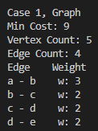

# Algorithmns-Class_HW5

Homework 5 of Algorithmns Class at GSU

On a 2D-plane shown as below,  some points with coordinates [xi, yi] are located. The cost of connecting two points [xi,  yi] and [xj, yj] is the manhattan distance between them: |xi - xj| + |yi - yj|,  where |val| denotes the absolute value of val.  
Return the minimum cost and connected edges to make all points connected. You can use either Prim  or Kruskal algorithm. Suppose the number of points is no more than 100. You don’t need to further  improve the algorithm.  
The coordinates can be Integer or Float (It doesn’t matter. Your code and test case can use Integer).

Example: Input Explanation: 

Output:

